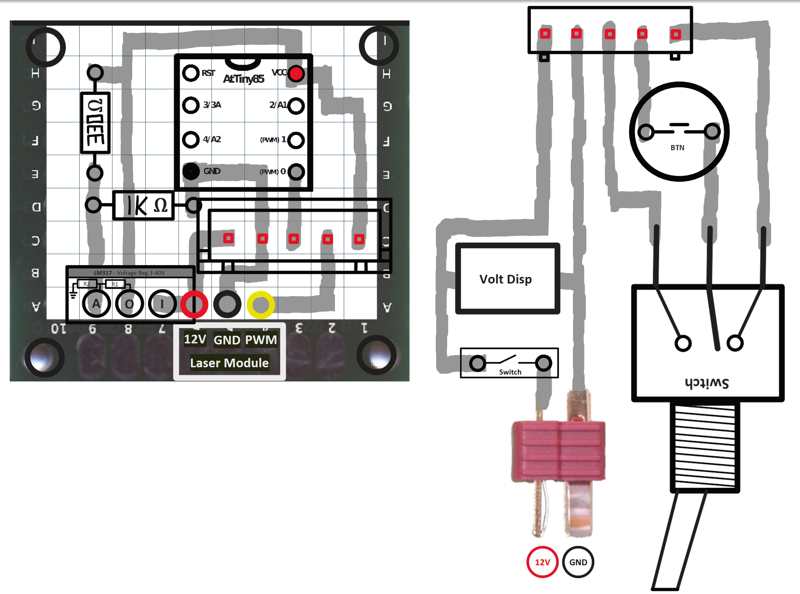
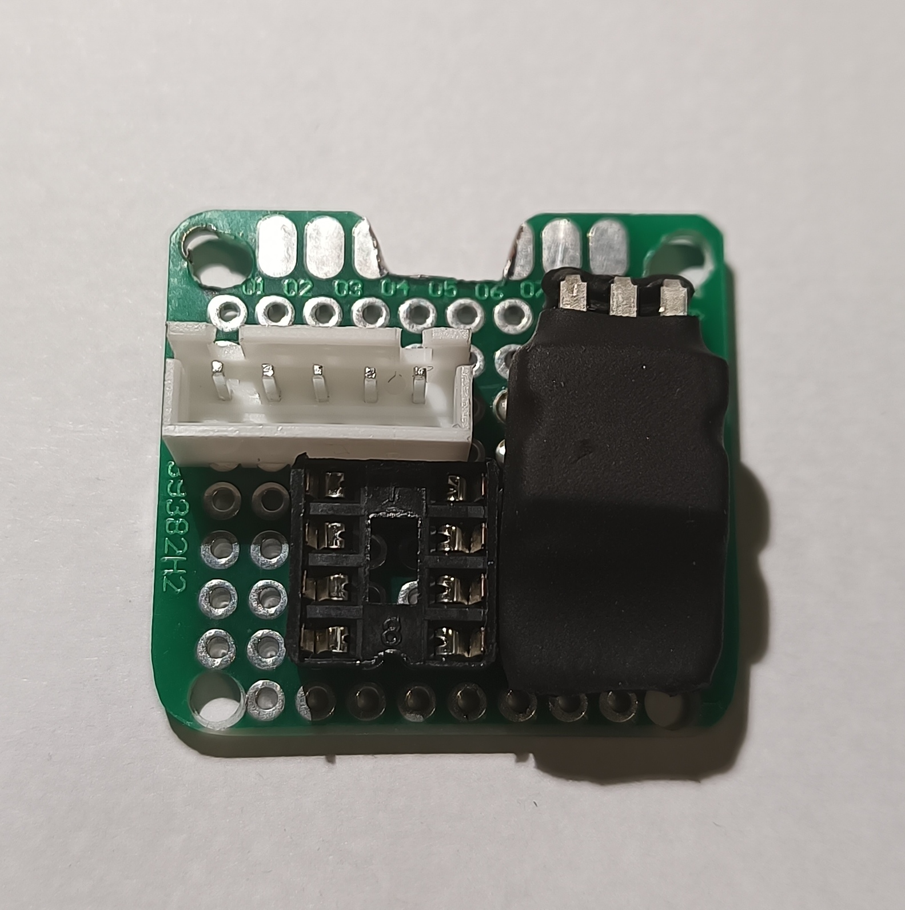
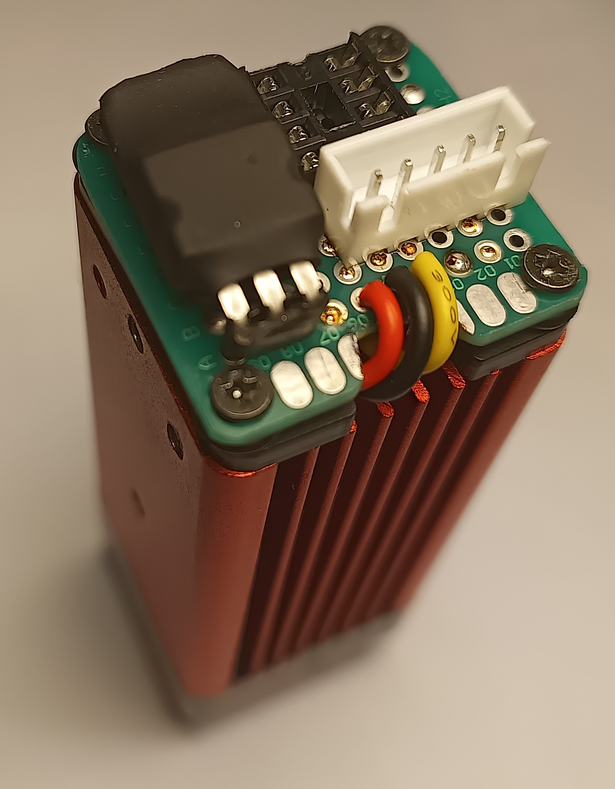

# ArcticRay

Circuit to control a laser.

## Features
- AtTiny85 supply PWM signal to control laser (didn't have 555 IC)
- Switch to choose between weak and strong laser output
- On / off switch
- 3 digit 8-seg display input voltage

## Perfboard circuit sketch

## Photos

